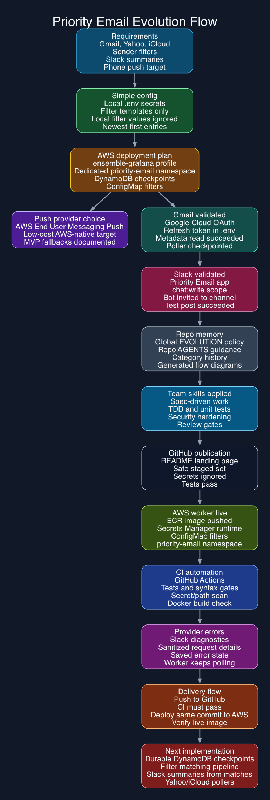

# Priority Email Evolution

This file summarizes how Priority Email evolved from the initial requirements prompt into the current project shape.

The repository does not contain a literal transcript of every prompt. This chronology is reconstructed from project artifacts such as requirements, deployment plans, filter templates, provider option docs, and repo policy files.

## At A Glance

For dark-background docs, slides, or Grafana-style presentation surfaces, use the dark flow export: [docs/evolution/diagrams/priority-email-evolution-flow-dark.png](docs/evolution/diagrams/priority-email-evolution-flow-dark.png).

- Full evolution package: [docs/evolution/README.md](docs/evolution/README.md)
- High-resolution PNG: [docs/evolution/diagrams/priority-email-evolution-flow.png](docs/evolution/diagrams/priority-email-evolution-flow.png)
- Dark high-resolution PNG: [docs/evolution/diagrams/priority-email-evolution-flow-dark.png](docs/evolution/diagrams/priority-email-evolution-flow-dark.png)
- SVG source export: [docs/evolution/diagrams/priority-email-evolution-flow.svg](docs/evolution/diagrams/priority-email-evolution-flow.svg)
- Dark SVG export: [docs/evolution/diagrams/priority-email-evolution-flow-dark.svg](docs/evolution/diagrams/priority-email-evolution-flow-dark.svg)
- Graphviz DOT source: [docs/evolution/diagrams/priority-email-evolution-flow.dot](docs/evolution/diagrams/priority-email-evolution-flow.dot)
- Dark Graphviz DOT source: [docs/evolution/diagrams/priority-email-evolution-flow-dark.dot](docs/evolution/diagrams/priority-email-evolution-flow-dark.dot)

## Prompt Categories

| Category | Evolution file | What changed |
| --- | --- | --- |
| Product and requirements | [product-requirements.md](docs/evolution/categories/product-requirements.md) | The product scope, supported mail providers, filtering model, notification behavior, platform standards, and security requirements were defined. |
| Deployment and operations | [deployment-operations.md](docs/evolution/categories/deployment-operations.md) | AWS deployment, Kubernetes namespace segregation, ConfigMap filters, secrets handling, and Grafana Labs observability standards were established. |
| Agent policy and safety | [agent-policy-safety.md](docs/evolution/categories/agent-policy-safety.md) | Global and repo-local evolution policy, GitHub safety rules, secret ignore patterns, and filter template rules were added. |

## Chronology

### June 21, 2026: Define The Product

Priority Email began as a requirements document for surfacing important email buried across Gmail, Yahoo Mail, and Apple iCloud Mail accounts.

Key evidence:

- `REQUIREMENTS.md`: product overview, goals, supported email providers, sender filter criteria, phone push notifications, Slack summaries, privacy requirements, reliability requirements, and acceptance criteria.
- `filters/domain-filters.txt`: local domain filter values for initial testing.

### June 21, 2026: Keep Initial Configuration Simple

The project adopted plain text filter files for the initial version, with separate files for sender domains, exact sender email addresses, and sender display names.

Key evidence:

- `filters/domain-filters.txt`
- `filters/email-address-filters.txt`
- `filters/sender-name-filters.txt`
- `REQUIREMENTS.md`: initial filter storage rules.

### June 21, 2026: Move To The Codex Workspace

The project moved from iCloud Drive to the Codex workspace at `/Users/orenlion/Documents/Codex/priority-email`.

Key evidence:

- Current project path: `/Users/orenlion/Documents/Codex/priority-email`.
- Compatibility symlink from the old iCloud Drive path to the new workspace path.

### June 21, 2026: Plan AWS Deployment

The deployment plan was created by referencing the Ensemble AWS deployment pattern while keeping Priority Email isolated in its own Kubernetes namespace.

Key evidence:

- `DEPLOYMENT_PLAN.md`: references the Ensemble deployment pattern, EKS, DynamoDB, Secrets Manager, IRSA, ConfigMap-mounted filters, dedicated `priority-email` namespace, and rollout validation.
- `REQUIREMENTS.md`: platform standards require AWS for cloud resources and Grafana Labs for observability.

### June 21, 2026: Choose Push Notification Direction

Push provider evaluation was documented with AWS-native resources preferred for deployment simplicity and cost control.

Key evidence:

- `PUSH_NOTIFICATION_OPTIONS.md`: recommends AWS End User Messaging Push for production and documents fallback options such as Slack mobile notifications, Pushover, and ntfy.
- `REQUIREMENTS.md`: push provider selection must verify provider status, support lifecycle, free tier, and pricing from primary sources where possible.

### June 21, 2026: Protect Secrets And Filter Values

The repository added local secret and filter-value safety rules before any future GitHub push.

Key evidence:

- `.gitignore`: ignores `.env`, `.env.*`, Google OAuth client secret files, generated secret YAML, Terraform variable/state files, and real `filters/*.txt` values.
- `.env.example`: committed-safe local environment template.
- `filters/*.txt.template`: committed-safe filter templates.
- `REQUIREMENTS.md`: local secrets must live in `.env`, real filter values must not be pushed, and only templates should be committed.

### June 21, 2026: Adopt Evolution Policy

The Ensemble EVOLUTION policy was promoted into global Codex guidance and applied to this repository.

Key evidence:

- `/Users/orenlion/.codex/AGENTS.md`: global Codex evolution-history policy.
- `AGENTS.md`: Priority Email repo policy for documentation updates, secret safety, filter safety, and platform standards.
- `EVOLUTION.md`: initial project chronology.
- `docs/evolution/categories/`: category-level evolution files for product requirements, deployment operations, and agent policy safety.

### June 21, 2026: Configure Gmail OAuth Project

Gmail OAuth moved from planned configuration to a concrete Google Cloud setup.

Key evidence:

- Google Cloud project: `Priority Email` with project ID `priority-email-500114`.
- OAuth consent screen app name: `Priority Email`.
- OAuth 2.0 clients: Web Application and Desktop App, both named `Priority Email - OAuth client`.
- `DEPLOYMENT_PLAN.md`: records the credential source and local status for gitignored `.env` values.
- `scripts/init-gmail-oauth.py`: local loopback OAuth helper for capturing `GMAIL_REFRESH_TOKENS` without printing secret values.
- `scripts/validate-gmail-read.py`: metadata-only Gmail read validation helper.
- Local Gmail read validation succeeded after enabling Gmail API for project number `877694096009`; the script read one message's metadata without printing tokens or full body content.
- `.env`: populated locally with Gmail OAuth client values and refresh token; this file remains gitignored.
- `.env.example`: includes `GMAIL_GOOGLE_CLOUD_PROJECT_ID=priority-email-500114` without exposing client secrets.

### June 21, 2026: Add Configurable Email Pollers

The project added a local poller entrypoint with Gmail implemented and Yahoo Mail/iCloud Mail stubs in place.

Key evidence:

- `scripts/poll-email.py`: configurable provider poller with Gmail support, local checkpoint state, and provider stubs for Yahoo Mail and iCloud Mail.
- `.env.example`: poller configuration keys for enabled providers, 10-minute interval, initialization limit, normal poll page size, and state file path.
- `REQUIREMENTS.md`: pollers must inspect only messages newer than the previous checkpoint after initialization and inspect only the latest 20 messages during first initialization.
- Local validation: Gmail initialization poll inspected 20 messages and set a checkpoint; the immediate second incremental poll returned 0 messages because no messages were newer than the checkpoint.

### June 21, 2026: Configure Slack App

Gemini configured the Slack integration for Priority Email.

Key evidence:

- Slack API flow completed: `Create New App` -> `From scratch` -> select workspace `ensemble-grafana`.
- Slack app name: `Priority Email`.
- OAuth & Permissions configured with `chat:write`.
- Slack app installed to the `ensemble-grafana` workspace.
- Bot User OAuth Token was copied for local use and must be stored only in gitignored `.env` as `SLACK_BOT_TOKEN`.
- `DEPLOYMENT_PLAN.md`: records the non-secret Slack app setup status and token handling rule.

### June 21, 2026: Add Slack Message Test

The project added a local Slack post validation script and attempted the first test message.

Key evidence:

- `scripts/test-slack-message.py`: posts a test message with `SLACK_BOT_TOKEN` and `SLACK_CHANNEL_ID` from gitignored `.env`.
- Local test initially returned `not_in_channel`; after the `Priority Email` app/bot was invited to the configured Slack channel, the Slack post test succeeded.
- `DEPLOYMENT_PLAN.md`: records the Slack test command and current blocker.

### June 21, 2026: Generate Evolution Flow Diagram

The project gained an Ensemble-style generated evolution flow diagram package.

Key evidence:

- `docs/evolution/README.md`: documents the evolution reading path and regeneration commands.
- `docs/evolution/diagrams/priority-email-evolution-flow.dot`: light Graphviz DOT source.
- `docs/evolution/diagrams/priority-email-evolution-flow-dark.dot`: dark Graphviz DOT source.
- Generated SVG and PNG exports exist for both light and dark variants.

### June 21, 2026: Import Team Engineering Skills

The repo pulled in and applied external team skills for specification, testing, review, simplification, security, and git workflow.

Key evidence:

- `AGENTS.md`: references the imported team skill files and converts them into repo working rules.
- `tests/test_poll_email.py`: adds unit coverage for Gmail poller initialization and incremental pagination behavior.
- `scripts/poll-email.py`: incremental Gmail polling now pages all messages newer than the prior checkpoint, and metadata output is opt-in with `--verbose`.
- `REQUIREMENTS.md`: documents development quality requirements and poller safety requirements.
- Generated evolution flow diagrams now include the team-skills quality gate.

### June 21, 2026: Reference Ensemble AWS Profile

Priority Email pulled in the non-secret AWS credential configuration needed to align with the Ensemble deployment workflow.

Key evidence:

- `.env` and `.env.example`: include `AWS_PROFILE=ensemble-grafana`, `AWS_ACCOUNT_ID=629513454417`, and `AWS_REGION=us-east-1`.
- AWS CLI validation: `aws sts get-caller-identity --profile ensemble-grafana` resolves to account `629513454417`.
- `REQUIREMENTS.md`: static AWS access keys must not be copied into project files.
- `DEPLOYMENT_PLAN.md`: documents profile-based AWS credential resolution.

### June 21, 2026: Publish Private GitHub Repository

The repository was prepared for its first GitHub push with committed-safe files only and published as a private GitHub repository at `https://github.com/orenlion1/priority-email`.

Key evidence:

- `README.md`: landing page with status, commands, documentation links, and secret/filter safety rules.
- `.gitignore`: excludes `.env`, real filter values, local state, pycache, Terraform state/vars, generated secret YAML, and Google OAuth client secret files.
- Initial staged set excludes gitignored `.env`, `.state/`, `filters/*.txt`, and `client_secret_*.apps.googleusercontent.com*`.
- `python3 -m unittest discover tests`: unit tests pass before publication.
- Staged safety scan found no forbidden paths or populated secret values before publication.

### June 21, 2026: Push Worker To AWS

Priority Email was packaged as a non-root Docker worker and deployed to the Ensemble EKS cluster in the dedicated `priority-email` namespace.

Key evidence:

- `Dockerfile` and `.dockerignore`: package only safe runtime files and exclude local secrets, real filters, state, and OAuth client secret JSON from the build context.
- `scripts/aws/deploy-to-aws.sh`: syncs `.env` to AWS Secrets Manager, builds/pushes the image to ECR, and applies Kubernetes manifests.
- `infra/k8s/`: namespace, service account, deployment, network policy, and PodDisruptionBudget for the isolated `priority-email` workload.
- AWS Secrets Manager: `priority-email/runtime` created or updated with the local runtime configuration.
- ECR image: `629513454417.dkr.ecr.us-east-1.amazonaws.com/priority-email-service:e181bdb`, digest `sha256:c8b074c30996f3ff8e0ce15bc1fd8d86dfc5380a5f7cf8a0572b3cb84fc7e8fa`.
- Kubernetes: `priority-email-service` rolled out successfully with one running replica.
- First AWS poller log: Gmail initialization inspected 20 messages and wrote the checkpoint to `/tmp/email-poller-state.json`.
- Storage finding: the Ensemble EKS cluster has no EBS CSI add-on installed, so PVC-backed file checkpoints were not available during this deploy. Durable checkpoints remain planned for DynamoDB.

## Current Shape

1. `REQUIREMENTS.md` defines the product, security, provider, and platform requirements.
2. `DEPLOYMENT_PLAN.md` defines the AWS/EKS deployment path with a dedicated `priority-email` namespace.
3. `PUSH_NOTIFICATION_OPTIONS.md` captures provider comparison and recommends AWS End User Messaging Push for production.
4. `.env.example` and `.gitignore` protect local secrets and prevent accidental GitHub pushes of credentials.
5. `filters/*.txt.template` files are safe to commit, while real `filters/*.txt` values stay local.
6. Gmail OAuth has a configured Google Cloud project and OAuth clients, with secrets still expected to live only in gitignored `.env`.
7. `scripts/poll-email.py` provides the first configurable Gmail poller with checkpointed incremental polling.
8. Slack app `Priority Email` is installed in workspace `ensemble-grafana` with `chat:write`; the bot token remains a gitignored local/deployment secret.
9. `scripts/test-slack-message.py` validates Slack posting once the app is invited to the configured channel.
10. Team engineering skills are imported into `AGENTS.md` and backed by the first unit tests for poller behavior.
11. AWS deployment access uses the Ensemble `ensemble-grafana` AWS CLI profile instead of static keys.
12. `README.md` documents the current safe local workflow for the private GitHub repo.
13. `EVOLUTION.md`, `docs/evolution/categories/`, and generated Graphviz flow diagrams preserve the project chronology.
14. `Dockerfile`, AWS helper scripts, and Kubernetes manifests deploy the initial Gmail poller worker to AWS.
